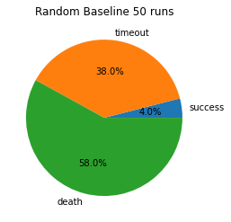
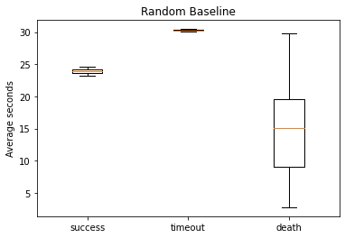
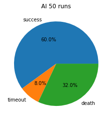
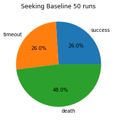
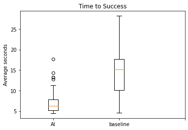

# Final Report

## Video

<iframe width="560" height="315" src="https://www.youtube.com/embed/SuKnrf1fcQg" frameborder="0" allow="accelerometer; autoplay; clipboard-write; encrypted-media; gyroscope; picture-in-picture" allowfullscreen></iframe>

## Project Summary
<!---
Use another level-two header to start a Project Summary section. Write a few paragraphs
summarizing the goals of the project (yes, yet again, but updated/improved version from the status). In
particular, make sure that the problem is clearly defined here, and feel free to use an image or so to set up
the task. Part of the evaluation will be on how well you are able to motivate the challenges of the problem,
i.e. why is it not trivial, and why you need AI/ML algorithms to solve it
-->
The goal of our project was the creation of an agent which could find and catch pigs using only image input. The environment is limited to a 5x9 rectangle riddled with barriers and lava. The goal is for our agent to track and reach pigs before falling victim to traps or running out of time. The agent is measured in its reliability of killing pigs, in the time it takes to kill pigs, and the number of times it dies. Agents and baselines alike automatically hit pigs within its line-of-sight with a diamond axe to denote it reaching its goal. Two swift strikes of the axe slay the (virtual) beast!

  

When in uncluttered environments, the problem is fairly simple to solve: a perfect agent in this case would turn to locate a pig and walk straight towards it. Once lava, trees, and blocks are introduced, it becomes difficult for simpler agents to manage unexpected obstacle arrangements. This project also has myriad parallels in ongoing areas of research, such as how to train search and rescue robots to navigate rubble after natural disasters or self-driving car obstacle avoidance. Though this application is simpler and virtual, removing some variables, it is clear that problems such as these require more than naive implementations of path-finding algorithms. In our problem setup, we are careful to not give our AI more than a realistic agent might get - no descriptions of specific obstacles or how/where they appear. In the environment riddled with obstacles, a perfect AI would perform akin to a floodfill depth first search with a heuristic towards the pig's exact location, hit it, and track it through any of it's panicked movements.


## Approaches

<!--
Use another level-two header called Approaches, In this section, describe both the baselines
and your proposed approach(es). Describe precisely what the advantages and disadvantages of each are,
for example, why one might be more accurate, need less data, take more time, overfit, and so on. Include
enough technical information to be able to (mostly) reproduce your project, in particular, use pseudocode
and equations as much as possible.
-->
### Introduction
 The crux of the project is the use of colormap video frames. These are video frames which have blocks and entities colored uniformly in unique colors to simplify vision tasks. When considering the real world, it is akin to having an object detection/classification system to operate on image data before using it as input.

### Baselines
Our project evaluates the performance of two baselines: one which moves randomly in our environment without taking into account the observations at all, and one which uses the pig pixels' relative position on the screen to naively turn and walk towards it by centering the pig. 

The one which uses the naive approach works well with no obstacles, seeking and finding the pig. 

  

#### Colormap Introduction
The approach our project takes is that of an agent which uses Malmo's Colormap Video frames to move and turn through the environment. Colormap video frames is a video frame which has blocks and entities colored uniformly in unique colors to simplify vision tasks. When considering the real world, it is akin to having an object detection/classification system to operate on image data before using it as input.

Though this simplifies the problem and the observation space, use of continuous movement by the agent means that there are still a massive number of possible observations, especially considering noise such as pigs hurting, crosshair highlighting, and lava sparks.

  

*Top left is what the colormap video looks like, right is the real minecraft environment. Lapis blocks are green, grass is red, and the pig is blue in the colormap video.*

### Proposed Solution
#### Raw Pixel Data
The approach our project takes is that of an agent which uses Malmo's Colormap Video frames to move and turn through the environment. This is meant to emulate simplfied camera data in a real robotic agent trying to overcome obstacles to get to a goal. Concretely, we use a PPO (Proximal Policy Optimization) Reinforcement Learning Algorithm with a fully connected neural network function approximator. The input is a 20x20x3 RGB image which is flattened before being input to the neural network. 

The neural network has two hidden layers of 256 nodes each, using a hyperbolic tangent (tanh) activation function. It also has a value function which mirrors the primary neural network architecture.

The algorithm was trained on an environment with obstacles of lava and logs in fixed positions to learn about the hazards and how to avoid them. The goal, as with the evaluation, was to attack and kill the pig. It was trained for approximately 3 hours and 280 epochs on one environment, and another 2 hours on a different one. 

Since the agent is trained on a fixed environment with no randomness, it is possible to overfit the example environment. For example, if the agent learns that it can avoid logs by moving around it to the left, but there is eventually a log next to the wall, the agent would fail to recognize that it cannot avoid the obstacle by avoiding it to the left. This can be overcome to some extent by further honing the training environment, or augmenting a previously-trained model with a new environment.

PPO Algorithm (Schuman et al.):
```
for each iteration:
    Run old policy based on theta_old in environment for T timesteps
    Compute advantage estimates A_hat_1 ... A_hat_t
    Optimize surrogate loss with respect to theta for each epoch and minibatch
    Update theta_old with a new theta
```

Rewards:
 * -20 per time step
 * (1 - np.exp(- # of pig_pixels)) * 30
 * +600 for each time the agent damages the pig
 * -1000 for dying
 * -1000 for running out of time
 * reward -= 3 * (count of steps) for staying in an already visited block
 * reward += 50 for visiting a previously unseen block
 * 600 - duration * 15

   

*The returns chart for training the agent on the first fixed environment. You can see the returns plateauing in the positive range as it learns to avoid obstacles and kill the pig*

   
 
*The returns chart for the secondary training on another fixed environment. This time, it converges more quickly upon a solution which has approximately the same reward value as the initial training.*


Action Space:
 * [0, 0.75] movement speed
 * [-0.5, 0.5] turn speed

<!-- #### Raw Pixel Data + Strafe Action Space
This is a slightly modified agent with the ability to move laterally without shifting the field of view. The previous agent has a simplified action space, in order to "move left" one would first have to "turn left" then "move forward" instead of being able to "move left" while still facing forward.

Rewards: Same as above

Action Space:
 * [0, 0.75] movement speed
 * [-0.5, 0.5] turn speed
 * [-1, 1] strafe speed -->

<!--
Need to add other approach of simplified space if that works
-->
## Evaluation
<!-- 
An important aspect of your project, as I’ve mentioned several times now, is evaluating your
project. Be clear and precise about describing the evaluation setup, for both quantitative and qualitative
results. Present the results to convince the reader that you have solved the problem, to whatever extent you
claim you have. Use plots, charts, tables, screenshots, figures, etc. as needed. I expect you will need at least
a few paragraphs to describe each type of evaluation that you perform. 
-->
Evaluation was performed by qualitatively and quantitatively by applying trained models in different environments. These environments were:
 * A 5x9 obstacle course to be completed in a maximum of 30 seconds
    * Player and pig spawn at far ends of the rectangle
    * 3 rows of hazards (blocks or lava) are randomly generated and placed between them
        * Rows have at most 3 / 5 blocks filled with hazards
        * Hazard rows are separated by a row of normal dirt blocks
 * An open world environment
    * Pigs and obstacles are spawned in at random in a 20x20 grid.
    * Much more difficult, more variables, large generalization of obstacle course goal

The quantitative measurements we used in evaluation were
 * How long it took to kill a pig (Mission duration)
 * Percentage of runs ending in death, time-out, and success

### Obstacle Course Environment
  

The baselines and our proposed PPO AI were set to perform the "obstacle course" to kill the pig. Keep in mind that the pig, after hit once, panics and moves sporadically through the course, introducing a lot of randomness. Since the obstacles are also in randomized positions through runs, one can consider this a fairly general experiment. 

Random Baseline: 

  

These results are for the agent which moves forward and turns randomly. Each trial's outcome was noted as success (killing the pig), timeout (using up the allotted 30 seconds), or death. In 50 runs only two were successful, establishing a minimum value for successes. Of the other runs, 19 were timeouts and a whopping 29 were deaths by meandering into either lava or the fire which has a chance to randomly spring up.

  

Here is plotted the time it took to reach each outcome. For example, since timing out took 30 seconds, the complete box plot of timing out is slightly above 30. Both of the successes for this random baseline were in the high 20s, implying that the randomized baseline is, as expected, not taking a very direct path towards the pig. On the other hand, the time it took to die is fairly well distributed throughout the time, also to be expected of random wandering.

AI vs Seeking baseline: 

    

Now that the graph format has been introduced and the baseline established, we can compare the AI and the naive seeking baseline. In these pie charts, we can see that the AI has over double the success rate of the seeking baseline, and dies about a third less often. These are very reasonable results for an AI facing a random set of obstacles, an almost infinitely large observation space, and random pig movement.

  
This graph is slightly different than that of the randomized baseline: comparing instead of holistically visualizing times to reach states. Here, you can see that the AI is finding and killing the pig not just more consistently, but also significantly faster than the seeking baseline. This is in spite of the seeking baseline attempting to follow a direct path to the pig. Concretely, the average time to success of the AI was 7.65 seconds, while the average time for the seeking baseline is 14.53 seconds. Our AI is not just more consistent, but also quicker than our baselines.

Qualitative Results

 The AI generally did a very good job at avoiding obstacles. It preferred patterns which it somewhat recognized from it's training, for example preferring to move left around log barriers and circle right around lava. This allowed it to pathfind to the pig fairly consistently, and it would not be stymied very often. Most cases in which the AI died, it noticed the lava, turned, but did not turn enough to walk across its edge. This is likely either because of delay between frames preventing proper detection before falling into lava becomes imminent or because the AI often attempts to take a slightly shorter path than necessary, making most lava avoidance very near the edge.

After hitting the pig once, the environment is somewhat "reset": the pig moves randomly through the course as it panics, and the AI is in an unfamiliar area of the map (having to turn around to re-navigate the course and kill the pig). This is another large portion of the timeouts and deaths. there were points in which the AI would find itself against walls or turning the wrong way to fall into lava. In the process of turning around, it also occasionally lost the pig. However, as the quantitative results suggest, it successfully found, reunited with, and killed the pig more often than not. It also performed better than the baseline at this renavigation, because the baseline has a chance of having a straight path to the pig, but after hitting, it would almost always try and fail to deal with obstacles.


### Open World Environment

The open world environment became a reach goal over the course of the project. The complexity of a more open world, with exponentially more obstacle arrangements, pig locations, hazards, and noise proved difficult for our model to handle. Though AI could reliably track and kill nearby pigs, it found troubles with the variety of obstacles and with tracking pigs in the distance.
   
*An early iteration of our open world AI that could track nearby pigs. Notably, this iteration has no lava!*

  
 
*The final open_world implementation. Extra pigs for consistency in results measurement, since none of our baselines/AIs were performant with just one pig*

Our final AI, designed to perform on the obstacle course with reduced randomness and scope, was set in this 20x20 environment with patterns of logs and lava indispersed throughout. Five pigs were spawned into random locations at least 5 blocks away from the agent, which spawned at the center of the area. 

Qualitatively, our final AI did not do a particularly good job at detecting and avoiding obstacles, had problems finding and tracking pigs far from it, but retained its ability to track nearby pigs should they be near. This indicates some overfitting to our obstacle course environment; especially since the obstacle course has distinct rows of obstacles to overcome rather than a space with obstacles in no easily recognizable pattern. The baselines, performing as expected, naively fell into lava and got trapped in corners. In particular, the seeking baseline often got stuck in corners as it stared at pigs, unable to turn out of the corner.

Quantitatively, the seeking baseline and the AI baseline performed approximately the same. Across 50 trials, both killed an average of about one pig before dying or running out of time. The AI, adept at getting out of corners, died more often than the baseline. That said, across deaths, the AI still survived on average 37.5% longer than the seeking baseline, indicating some obstacle avoidance.

We also attempted to implement Q-Learning in a simplified version of the open world environment. This environment only included one pig and no obstacles. It did not perform as well as the model trained using PPO. The Q-Network only managed to hit the pig in 16% of the trials and killed the pig in 6% of trials. When it did manage to kill the pig it seemed to be based off luck rather than skill. The average time it took to kill a pig was 16.5 seconds. This average is most likely low because the agent would only manage to kill the pig when it spawned next to it. This is based on 100 evaluation trials run with a trained network. While visually observing the agent we would see it go in circles and only move after the pig if the pig was within a short range of the agent.

## References
During some parts of development, particularly designing reward functions, learning rates, the network, and evaluation we used primarily:  
 * [Deep Reinforcement Learning Robot for Search and Rescue Applications: Exploration in Unknown Cluttered Environments](https://ieeexplore.ieee.org/document/8606991)  
 * [Robotic Search & Rescue via Online Multi-task Reinforcement Learning](https://arxiv.org/abs/1511.08967)  
 * [Reinforcement learning in robotics: A survey](https://journals.sagepub.com/doi/full/10.1177/0278364913495721)  
as well as a couple other less applicable papers.
 * [PPO OpenAI paper (‎Schulman et al.)](https://arxiv.org/pdf/1707.06347.pdf)

In development, we used 
 * [Malmo XML Documentation](https://microsoft.github.io/malmo/0.30.0/Schemas/MissionHandlers.html)
 * [Malmo Python Examples](https://github.com/microsoft/malmo/tree/master/Malmo/samples/Python_examples) 
    - Specificially..
    - [Hit test](https://github.com/microsoft/malmo/blob/master/Malmo/samples/Python_examples/hit_test.py)
    - [Radar test](https://github.com/microsoft/malmo/blob/master/Malmo/samples/Python_examples/radar_test.py)
    - [Depth map runner](https://github.com/microsoft/malmo/blob/master/Malmo/samples/Python_examples/depth_map_runner.py)
 * [Ray/RLLib Documentation](https://docs.ray.io/en/master/rllib.html)
    - In particular
    - [Custom Models](https://docs.ray.io/en/stable/rllib-models.html#custom-models-pytorch)
    - [Visionnet.py](https://github.com/ray-project/ray/blob/master/rllib/models/torch/visionnet.py)
 * [PPO Hyperparameter RL medium article](https://medium.com/aureliantactics/ppo-hyperparameters-and-ranges-6fc2d29bccbe)
 * [PPO explained](https://jonathan-hui.medium.com/rl-proximal-policy-optimization-ppo-explained-77f014ec3f12)
 * [RL Function approximation article](https://towardsdatascience.com/function-approximation-in-reinforcement-learning-85a4864d566)
 * And of course, class examples for RLLib with Malmo
