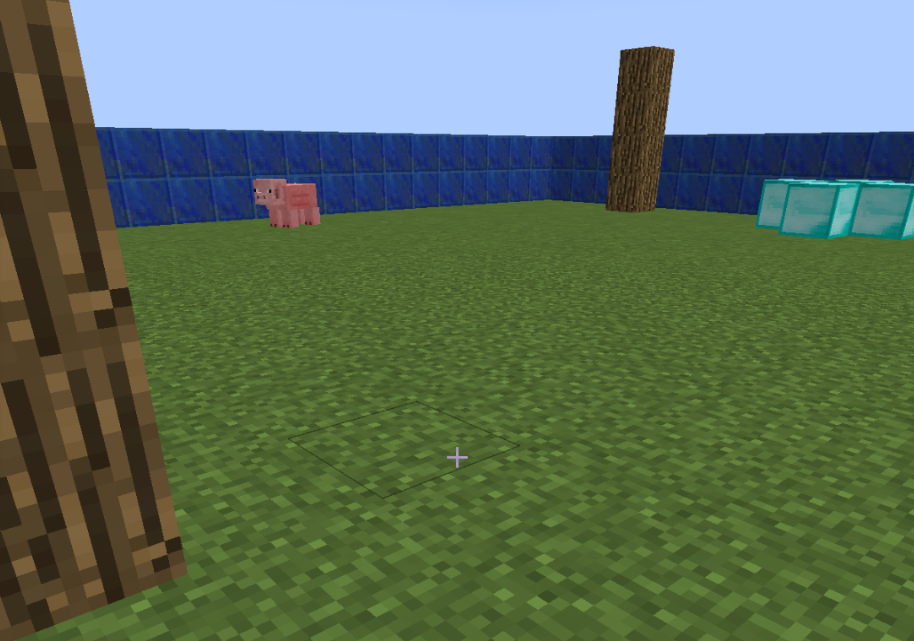

# Final Report

## Video

## Project Summary
<!---
Use another level-two header to start a Project Summary section. Write a few paragraphs
summarizing the goals of the project (yes, yet again, but updated/improved version from the status). In
particular, make sure that the problem is clearly defined here, and feel free to use an image or so to set up
the task. Part of the evaluation will be on how well you are able to motivate the challenges of the problem,
i.e. why is it not trivial, and why you need AI/ML algorithms to solve it
-->
The goal of our project was the creation of an agent which could find and catch pigs using only image input. Our agent spawns in the center a 20x20 bounded world containing various sparse obstacles in the form of blocks, trees, and lava pits. The goal is for our agent to track and reach pigs before falling victim to traps or running out of time. The agent is measured in its reliability of killing pigs, in the time it takes to kill pigs, and the number of times it dies. Our agent automatically hits pigs within its line-of-sight to denote it reaching its goal.

  

When in uncluttered environments, the problem is fairly simple to solve: a perfect agent in this case would turn to locate a pig and walk straight towards it. Once lava, trees, and blocks are introduced, it becomes difficult for simpler agents to manage unexpected obstacle arrangements. This project also has myriad applications in ongoing areas of research, such as how to train search and rescue robots to navigate rubble after natural disasters or how to create robots which can learn simple tasks. Though this application is simpler and virtual, removing some variables, it is clear that problems such as these require more than naive implementations of path-finding algorithms. In our problem setup, we are careful to not give our AI more than a realistic agent might get - no descriptions of specific obstacles or how/where they appear.

## Approaches

<!--
Use another level-two header called Approaches, In this section, describe both the baselines
and your proposed approach(es). Describe precisely what the advantages and disadvantages of each are,
for example, why one might be more accurate, need less data, take more time, overfit, and so on. Include
enough technical information to be able to (mostly) reproduce your project, in particular, use pseudocode
and equations as much as possible.
-->

### Baselines
Our project evaluates the performance of two baselines: one which moves randomly in our environment without taking into account the observations at all, and one which uses the pig pixels' relative position on the screen to naively turn and walk towards it. 
<!--
Continue evaluating with more data
-->

### Proposed Solutions
The approach our project takes is that of an agent which uses a Malmo's Colormap Video frames, a simplified
<!--
Need to add other approach of simplified space if that works
-->
## Evaluation

## References
During some parts of development, particularly designing reward functions, learning rates, the network, and evaluation we used primarily:  
 * [Deep Reinforcement Learning Robot for Search and Rescue Applications: Exploration in Unknown Cluttered Environments](https://ieeexplore.ieee.org/document/8606991)  
 * [Robotic Search & Rescue via Online Multi-task Reinforcement Learning](https://arxiv.org/abs/1511.08967)  
 * [Reinforcement learning in robotics: A survey](https://journals.sagepub.com/doi/full/10.1177/0278364913495721)  
as well as a couple other less applicable papers.

In development, we used 
 * [Malmo XML Documentation](https://microsoft.github.io/malmo/0.30.0/Schemas/MissionHandlers.html)
 * [Malmo Python Examples](https://github.com/microsoft/malmo/tree/master/Malmo/samples/Python_examples) 
    - Specificially..
    - [Hit test](https://github.com/microsoft/malmo/blob/master/Malmo/samples/Python_examples/hit_test.py)
    - [Radar test](https://github.com/microsoft/malmo/blob/master/Malmo/samples/Python_examples/radar_test.py)
    - [Depth map runner](https://github.com/microsoft/malmo/blob/master/Malmo/samples/Python_examples/depth_map_runner.py)
 * [Ray/RLLib Documentation](https://docs.ray.io/en/master/rllib.html)
    - In particular
    - [Custom Models](https://docs.ray.io/en/stable/rllib-models.html#custom-models-pytorch)
    - [Visionnet.py](https://github.com/ray-project/ray/blob/master/rllib/models/torch/visionnet.py)
 * [PPO RL medium article](https://medium.com/aureliantactics/ppo-hyperparameters-and-ranges-6fc2d29bccbe)
 * [RL Function approximation article](https://towardsdatascience.com/function-approximation-in-reinforcement-learning-85a4864d566)
 * And of course, class examples for RLLib with Malmo